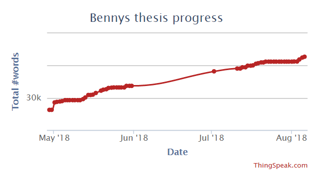

# Track your LaTeX progress

Here my small script which I run with cron on a daily basis on a raspberry Pi to track the progress of my PhD thesis written in LaTeX. The thesis is saved on Overleaf.com.

# What do I need?
- Document written in LaTeX saved in a git repo. The scripts must be able pull from the Git repo. 
- Unix server (Raspberry pi for example)
- Free account on [thingspeak.com](www.thingspeak.com)

# Features
  - Pulls latest TeX files from a git repository (like Overleaf or GitHub or...)
  - Counts the words in the LaTeX document and pushes the value to [thingspeak.com](www.thingspeak.com)
  - On thingspeak.com you can see your daily progress and even make it public
  - Saves more detailed analysis results into a log file in the same folder as the script

# Dependencies
- perl
- git

# HowTo
  1. Copy the files "*.sh" and "*.pl" files to a directory on your Linux machine
  2. Checkout your thesis repository on your Linux machine and make sure "git pull" works in the folder without entering credentials. Adjust the repo path in "PhDCounter.sh" and "PhDCounterOffline.sh". 
  3. Create an account and a new channel on thingspeak.com, insert your "Write API key" into the "PhDCounter.sh" file. In the created channel make sure to have at least one field, check the "Channel settings"
  4. Create a cronjob on your Linux machine to start your PhDCounter.sh file periodically
       - Run "crontab -e" in the shell
       - insert f.e.: "55 5 * * * /home/pi/programming/tex/PhDCounter.sh" in the end of the file to run the sh file every day a 5:55 AM, adjust the file path to match yours
  5. Test by running "sh /your-path-here/PhDCounterOffline.sh". You should see after a succesfull git pull a number indicating the number of words (without comments) in your thesis. Test additionally by running "sh /your-path-here/PhDCounter.sh". If everything was setup correctly you should have this counter pushed to your graph at thingspeak.com. Additionally a log file is created with a more detailed analysis.

Have fun and stay focused on your goals :)

Credits:
The perl script is from [Einar Andreas Rodland](http://app.uio.no/ifi/texcount/), Copyright 2008-2018
